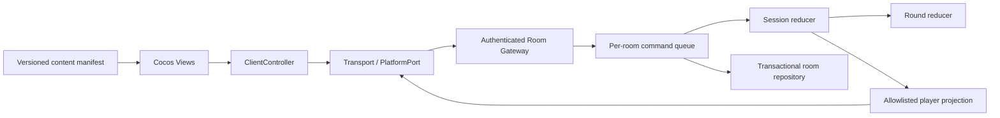

# 架构与技术栈

## 已选择的栈

| 层 | 选择 | 边界 |
|---|---|---|
| 手机客户端 | Cocos Creator 3.8 LTS 系列、TypeScript、2D UI | 首次检测后锁定实际补丁版本；不使用复杂 3D/物理 |
| 核心规则 | 纯 TypeScript、JSON 数据、不可变 reducer | 不引用 Cocos、wx 或 Node |
| 平台适配 | `PlatformPort` 接口，WeChat/Browser/Local 实现 | 登录、分享、前后台、存储、网络差异集中处理 |
| 网络 | HTTPS 登录/房间操作 + WSS 对局连接 | 单房间串行命令队列、快照恢复；无需帧同步 |
| 服务端 | Node.js 24 LTS 基线、TypeScript | 客户端不运行权威发牌和计分 |
| HTTP/WS 库 | M2 首先采用 Node HTTP + ws，依赖版本安装时核验并锁定 | 不为小工程引入大型微服务框架 |
| 存储 | SQLite，单实例起步 | 事务保存状态、命令回执、revision；后续多实例再评估 PostgreSQL/Redis |
| 素材 | 版本化 JSON 清单 + 缩略图 + 按需资源包 | 制作工具可用 Python；运行时不依赖 Python |
| 测试 | Node 内建 test；构建后补 TypeScript 静态检查 | 微信真机与 Cocos 构建单独验收 |

SQLite 驱动在 M2 按本机可用 Node 和打包方式选择并锁版本。不得把内存存储演示标记为持久化完成；不得阻塞所有开发等待数据库依赖。

## 模块依赖

## 目录落实方式

`packages/core/src` 包含 json、rules、setup、round、session、projection。核心事件保留 public/private 分区，离开服务端前必须投影。

`packages/protocol/src` 只定义网络 DTO，不导出完整 SessionState。客户端工程不得从 server 引用代码。`packages/content/src` 保存搜索等非权威纯函数。

`apps/server/src` 按 auth、rooms、transport、persistence、content、ops 分层。一个房间只有一个写入者；MVP 单进程，不用分布式锁伪装已支持横向扩容。

`apps/client-cocos/assets/scripts` 按 boot、platform、transport、controller、views、content 分层。跨 packages 的客户端模块用构建脚本机械同步到 generated 目录，并记录文件 hash；禁止复制后各自修改两份源代码。若 .ts 扩展名不适合 Cocos 导入，由同步脚本统一转成编辑器接受的相对引用，不逐文件手工修补。

## 权威与权限

房主是玩家权限概念，不等于可信服务端。房主可以请求开局/结束，但不能指定种子、牌墙、计分或替别人摸牌。旧核心允许可信 host 代摸的能力只保留给内部测试/宿主适配；网络入口必须拒绝玩家房主代摸。

服务端生成 session/round/command 去重范围与秘密洗牌输入。初版保持旧 Park–Miller 算法用于兼容性测试；公开网络开局建议服务端用加密随机 Fisher–Yates 生成显式 wall/dice，走核心已有 explicit 输入，不向客户端下发完整牌墙。区别“可复现测试”和“公开对局不可预测”。

## 提交和持久化顺序

认证并绑定身份 → 载荷校验 → 进入房间串行队列 → 先查询幂等账本 → 检查版本/上下文 → reducer → 同一事务写状态与回执 → 提交成功 → 生成并发送各人投影。

写盘失败不 ACK 成功、不推进内存权威状态。提交成功但推送失败，客户端用相同 command_id 重试或请求快照。拒绝动作也缓存回执，以与旧会话语义一致；限制请求频率、载荷和房间生命周期，避免账本无限增长。

## 连接与恢复

每次连接绑定 actor/session/room 和 connection generation。旧连接重连后失效，不得复用为第二个控制端。恢复始终返回当前完整玩家快照；revision 只递增，事件用于表现，不要求客户端重演才能得到正确状态。

已提交但未收到 ACK 的命令保留原 ID；明确被拒绝后用户重新操作才生成新 ID。客户端重连先恢复快照，丢弃已过 round/turn/proposal 的草稿。不得把断线前的客户端完整状态当作恢复来源。

## 官方资料（2026-09-27 检查）

- Cocos 微信构建、远程资源、缓存管理：[官方文档](https://docs.cocos.com/creator/3.8/manual/zh/editor/publish/publish-wechatgame.html)。
- Node 支持周期：[官方版本说明](https://nodejs.org/en/about/previous-releases)。
- 微信 API 与具体包体额度在 M4 再按实际基础库/开发者工具核验；不要将其他小游戏平台或普通小程序额度混用。
